# Exploratory Data Analysis — Fraud Detection Dataset

## Overview
- Labeled transactions analysed: **400,001**
- Confirmed fraud: **7,338** (1.83%)

## Key Insights
- 25.2% of fraud occurs between 01:00-04:00 NPT
- 1.5x fraud lift at ~9999/49999/99999 amounts
- 44x fraud lift for MERCH-8812/9041/7712
- 6.0% of fraud flagged with impossible travel
- VPN present in 6.0% of fraud vs 0.0% of legit
- Top fraud type: SIM_SWAP at 10.3% of fraud

## Baseline Comparison
- Rule-engine baseline AUROC: **0.71** (target to beat).
- Structuring, fraud-merchant, night-window, impossible-travel and device-root signals above show clear separation and should drive a large AUROC lift.

## Feature Engineering Recommendations
- Keep `is_structuring_amount`, `is_fraud_merchant`, and `dev_locale_mismatch` as high-signal binary features (very large fraud lift).
- Weight `vel_z_score_amount` and `geo_impossible_travel` heavily in the velocity/geo agents.
- Use `hour_of_day`/`is_night` interactions — night window concentrates account-takeover fraud.
- Risk-tier progression is monotonic; `cust_risk_tier` one-hots are useful priors.

## Plots
### Amount Distribution
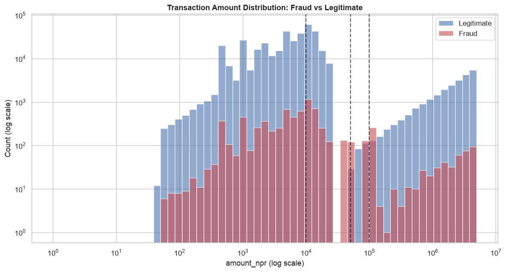

### Correlation Heatmap
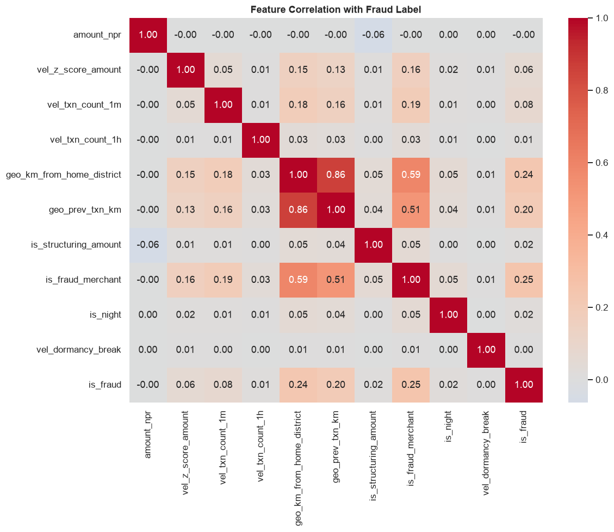

### Device Risk
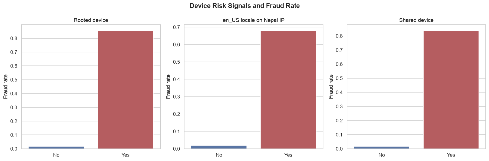

### Fraud By Channel
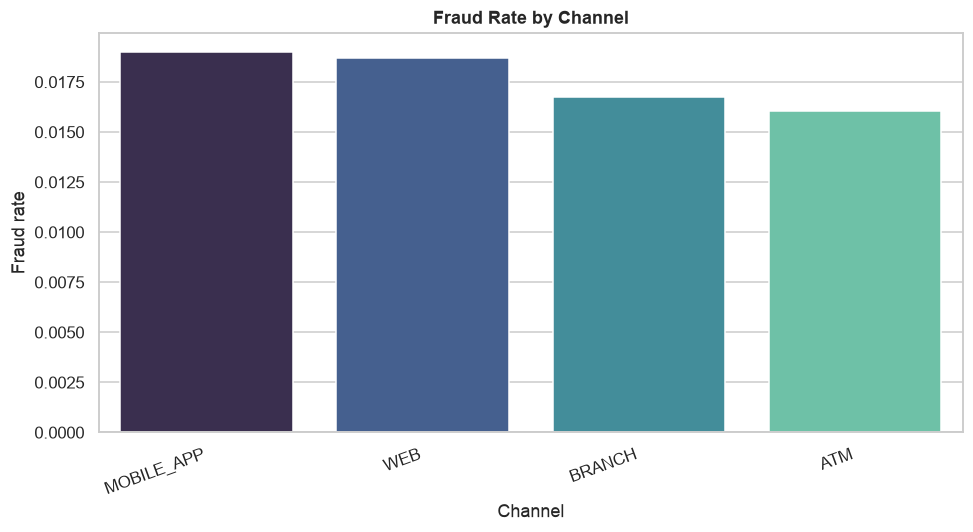

### Fraud By Day Of Week
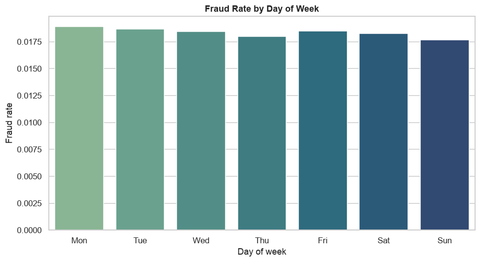

### Fraud By Hour
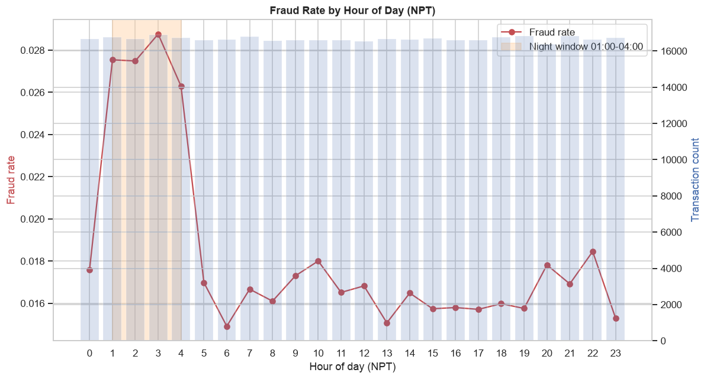

### Fraud By Txn Type
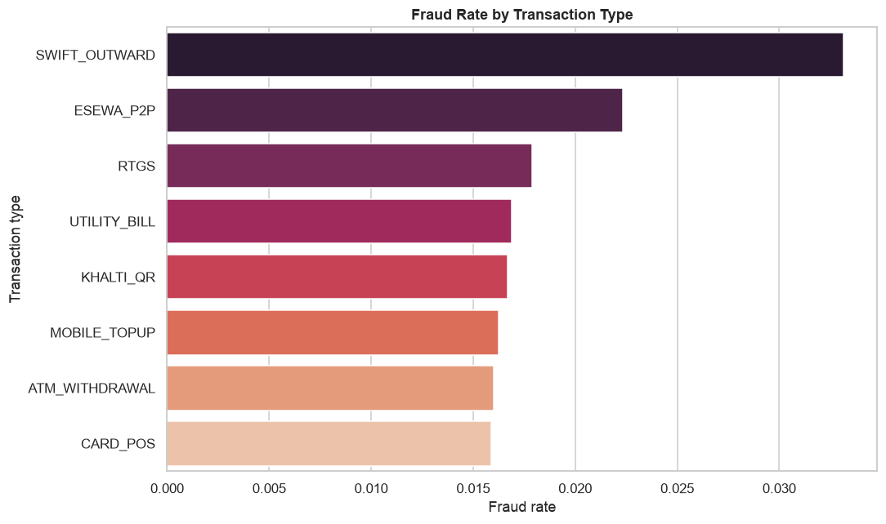

### Fraud Rate Overview
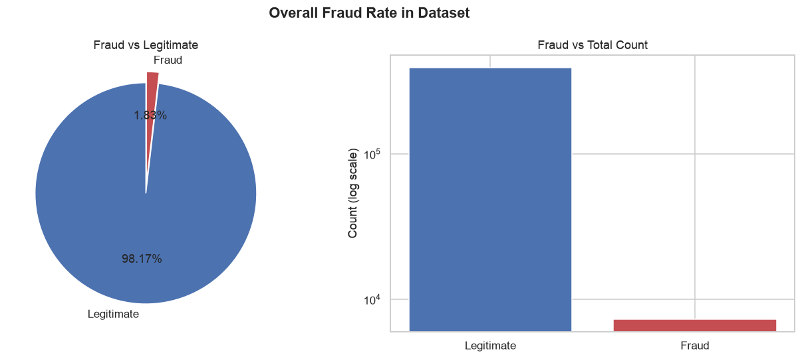

### Fraud Type Distribution
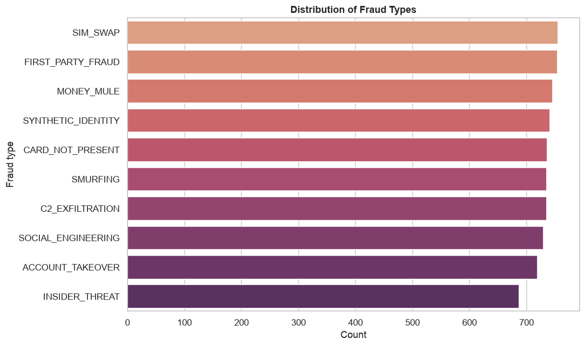

### Geo Risk Flags
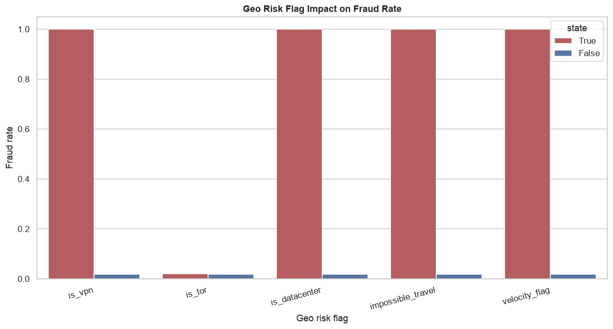

### Otp Analysis
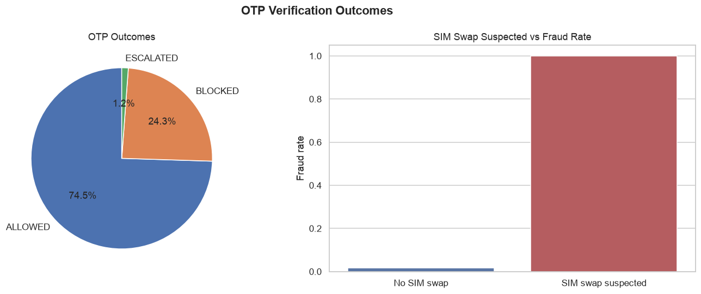

### Risk Tier Fraud Rate
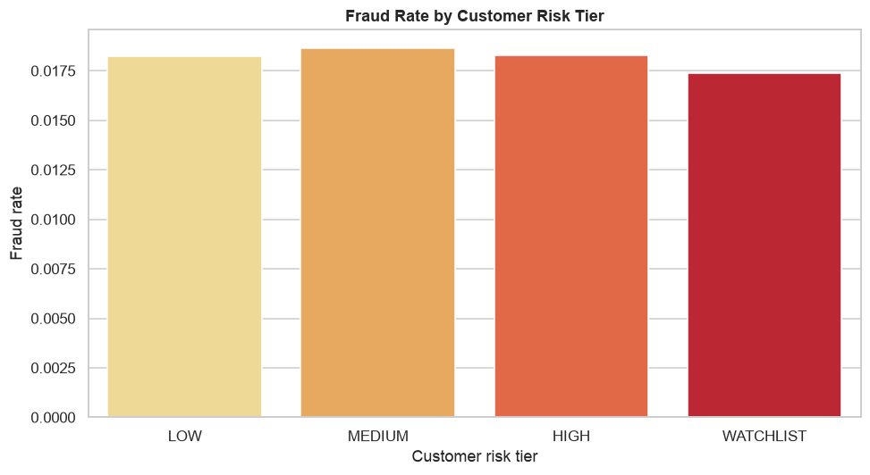

### Structuring Pattern
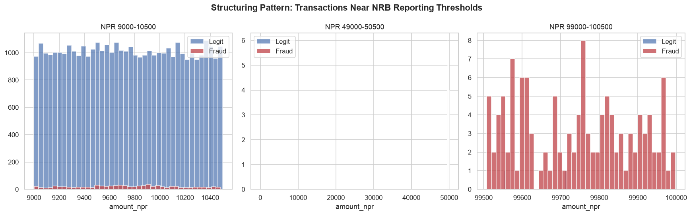

### Velocity Heatmap
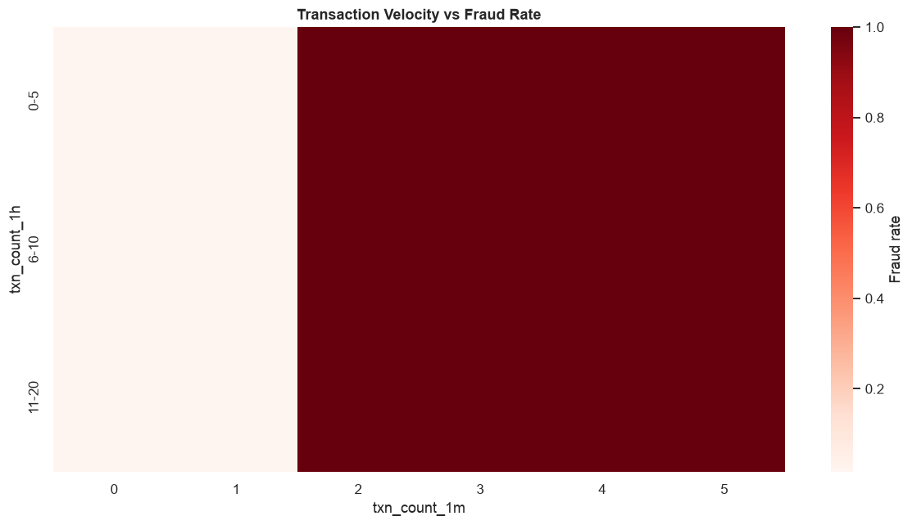

### Z Score Distribution
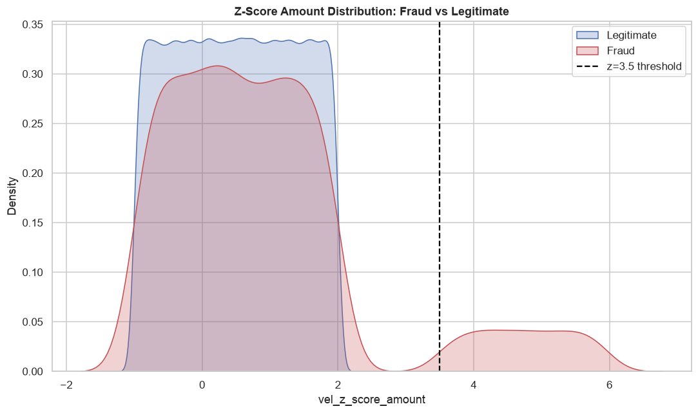
